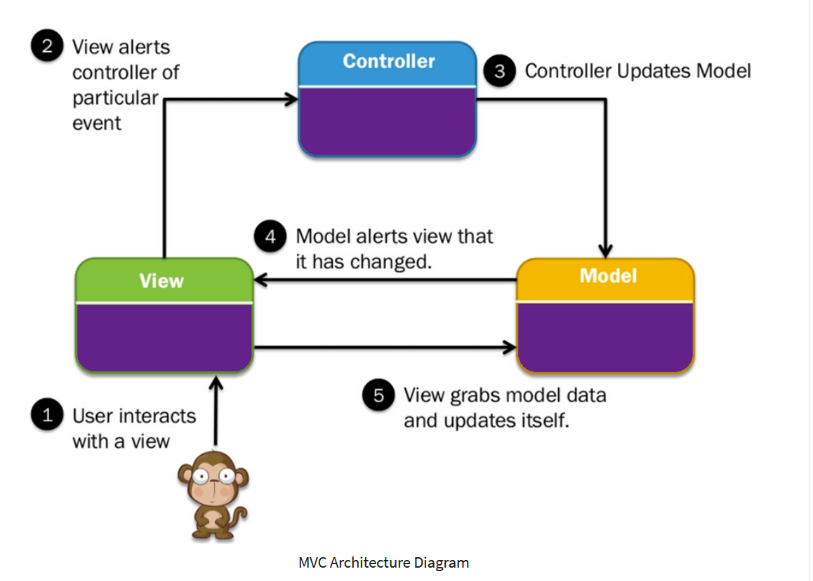

# PHP - Pricecaclulating Heroes Present!
This is a challenge that Glenn and I will tackle on together.
We need to apply basic OOP principles, import data with a database, and learn to use an MVC.
Calling this challenge a real challenge would be an understatement.

## The First Step
We decided that we'll start out by reading up on MVC's, skimming through the boilerplate code we received, and just try to make sense of it all.
The coaches have also given us a small to-do list to help us get started.

- [x] explore what is mvc ? why is everything a class? send help plz
- [x] make DB
- [x] make connection between controller/model and DB
- [x] display data to test connection
- [x] DO IT ALL ON HOMEPAGE FOR TESTING REFACTOR LATER

Our current major goal is to be able to make a connection between the controller/model and the database.
Once we have a way better understanding of this exercise, we will be able to create a more concrete TO-DO list.
And with that TO-DO list, we will be able to create a working price-calculating website that we can both be proud of!

## MVC - Explained (as best as we can)
Now that we were finally able to make a connection, we want to have a deeper understanding of MVC, so we can figure out the next steps we should take.
We found a very neat article [that you can read here](https://www.guru99.com/mvc-tutorial.html) that helped us out a lot.
And for those that are more visual learners, there is a neat image that we added here down below that explains it very well.
In the README given to us by the coaches, they also wrote down some key qualities that the MVS structure needs to adhere to.
````
For now you should create 3 different directories:
- Controller: has access to GET/POST vars, receives the Request
- Model: Most of your code should be here, for example the Product and Customer class.
- View: Your HTML files.
````



With this information, we think that these have to be our next goals:
- [ ] Put the code that gets us the database in the model folder
- [ ] Test out the controller and view
  - [ ] Add code to the controller to create variables. These variables call on the Getter that was set in the module to get more specific information.
  - [ ] Echo the variables that were made in the controller onto the view.
This is something we will do in group.
As long as we still don't have any small, concrete goals and we're still figuring out stuff, working together is advised.
Once we're done with this small TO-DO list, Glenn and I will once again come together and figure out the next step.
The most important thing we have to figure out, is what classes should be created exactly in the model.
